# Project Management

    
    
    
    
     
    
    
    
     
    
     
    

# Introduction

Helper, is a great tool if you want to manage your projects, tickets and be here for your clients

It comes also with more than 60 languages ready to use.

All this made with the best technologies.

## Prerequisites

- PHP 8+
- MySQL 8+
- [Pusher](https://pusher.com/) account

## Screenshots

    </img> 
    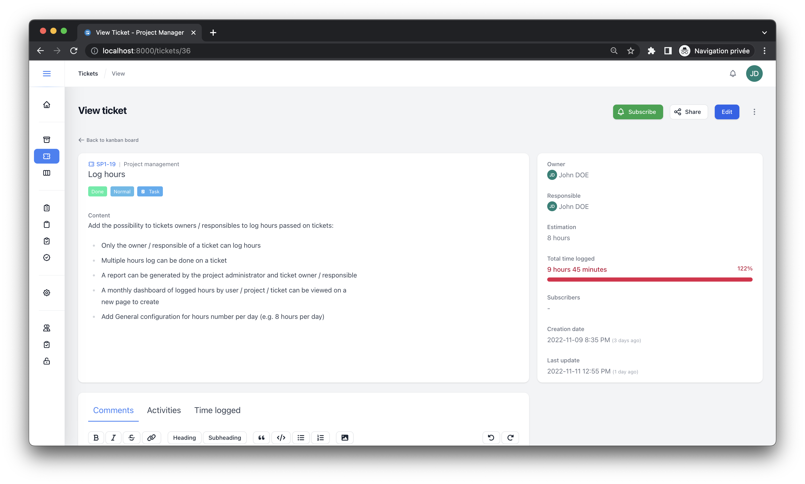</img> 
    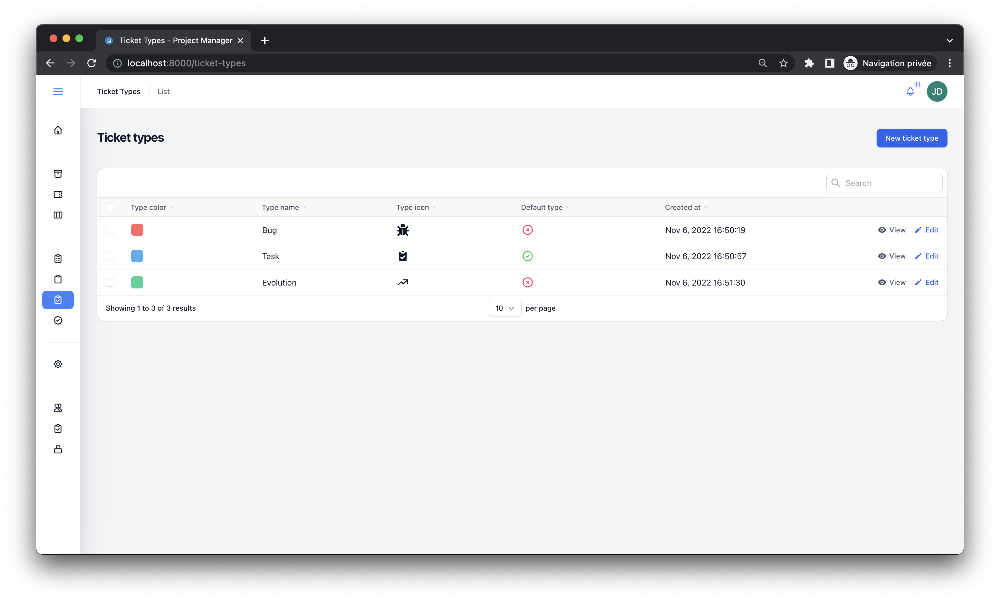</img> 
    </img> 
    </img> 
    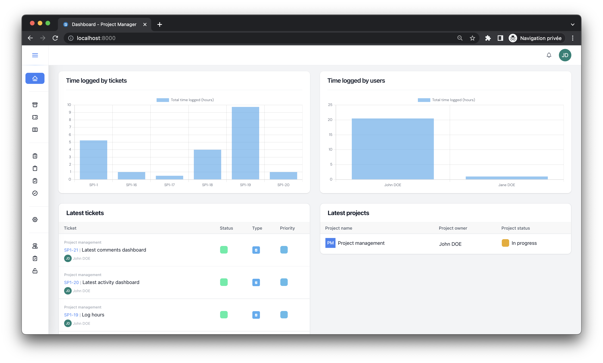</img> 
    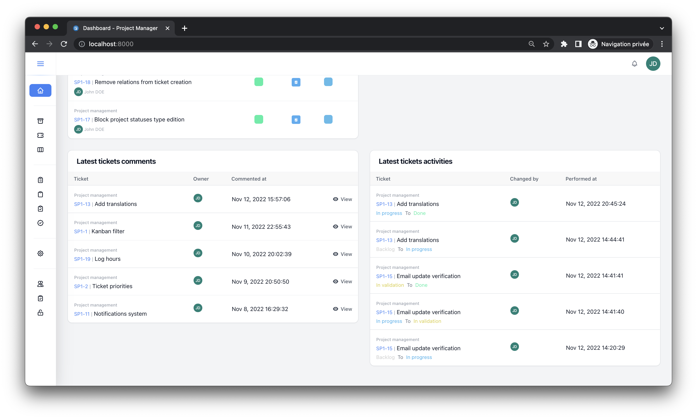</img> 
    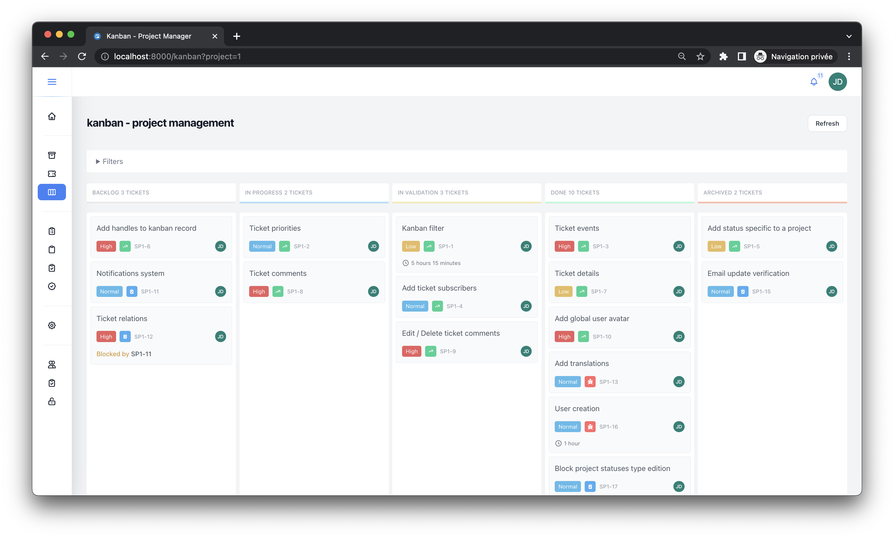</img> 
    </img> 
    </img> 
    </img> 
    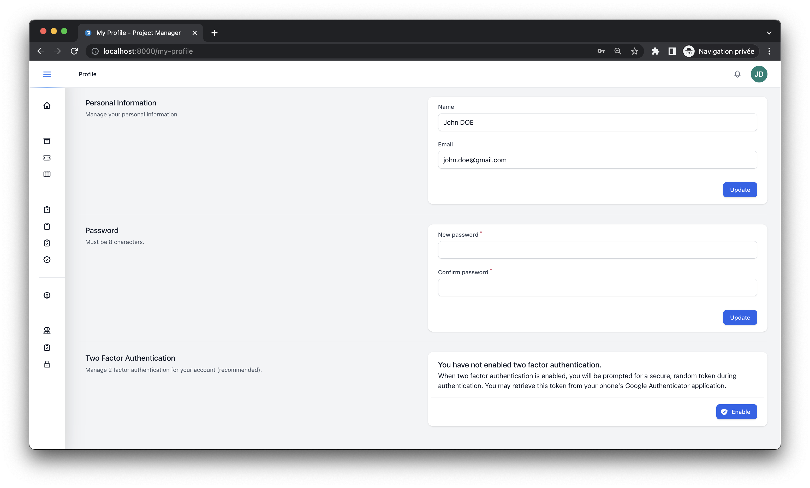</img> 
    </img> 
    </img> 
    </img> 
    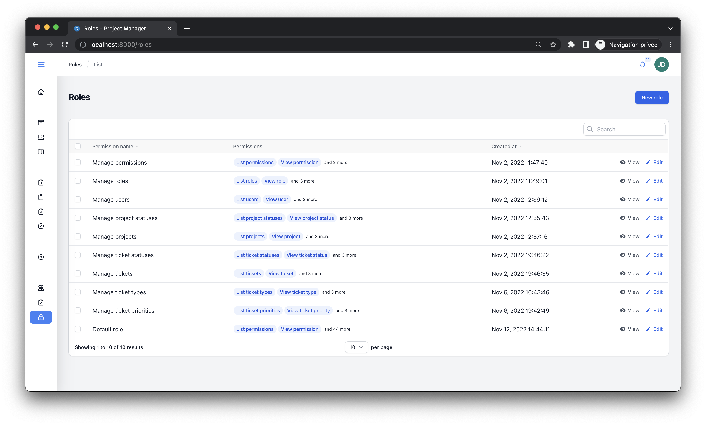</img> 
    </img> 
    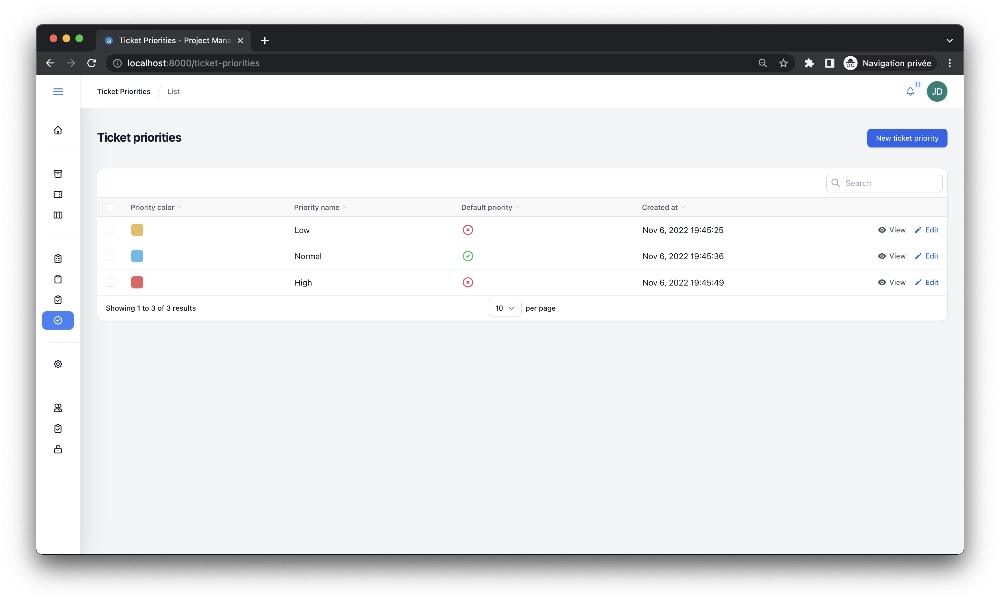</img> 
    </img> 
    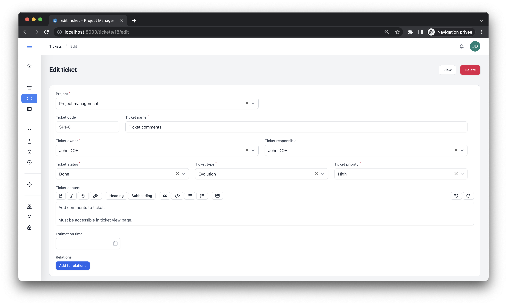</img> 
    </img> 
    </img> 
    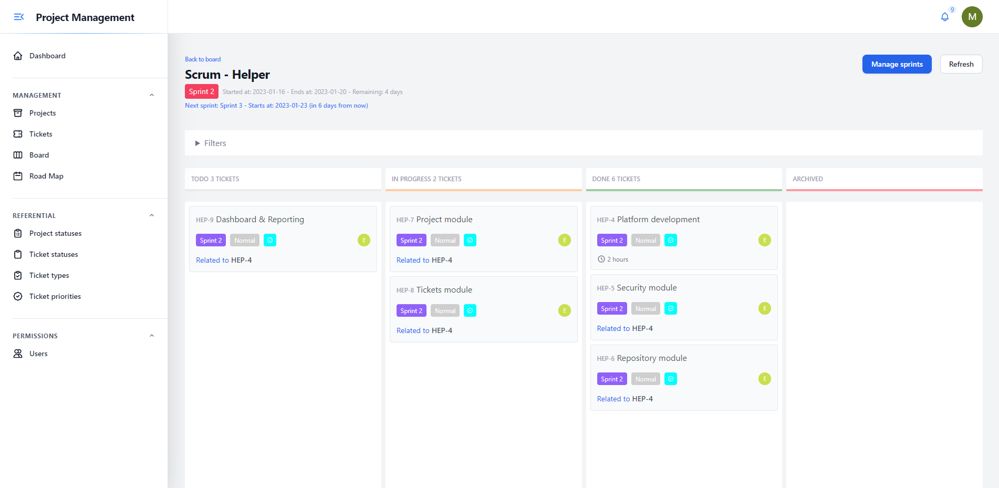</img> 
    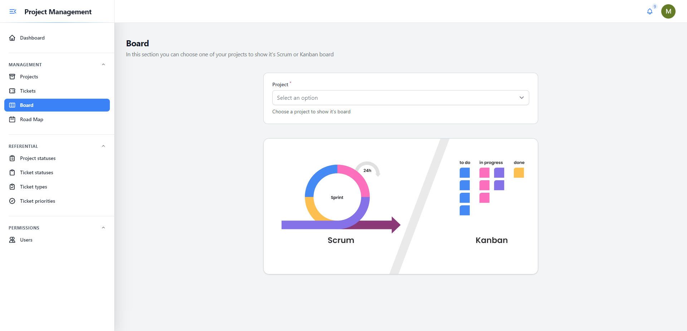</img> 
    </img> 
    </img> 

## Documentation

Full documentation can be viewed online: [Docs](https://devaslanphp.github.io/project-management)

## Work in progress

We are always working to make Project Management a better application, all contributions are welcome.

## Translations

**Important:** translations are automatically generated by Google Translate (using a custom command), so if you find any errors please make sure you create a ticket or add your translations as a contribution to this repository.

## Credits

- [All Contributors](https://github.com/devaslanphp/project-management/graphs/contributors)

## License

The MIT License (MIT). Please see [License File](LICENSE.md) for more information.

## Releases

- **Release 1.0.0**
  - First Release
- **Release 1.1.0**
  - Add _Road Map_ feature
  - Manage _Epics_ by projects
- **Release 1.1.1**
  - Add issue creation (dialog) into kanban view
- **Release 1.1.2**
  - Add Epic parent link (dependencies)
- **Release 1.1.3**
  - Translate missing langs
- **Release 1.1.4**
  - Bug-fix: Ticket content field (required)
- **Release 1.1.5**
  - Add comment field to ticket hours logging
- **Release 1.1.6**
    - Edit ticket epic details
    - PR #13 made by @mihaisolomon
- **Release 1.1.7**
    - Ticket attachments
- **Release 1.1.8**
    - Time logged activities #25 PR integration
    - #19 by @mihaisolomon : 
      - Add new resource `Activity` to referential
      - Add `Activity` to ticket time logging
      - Add `Activity` column to Excel exportation
- **Release 1.1.9**
    - #32 Default user seeder enhancement
    - #31 Issue resolved
- **Release 1.2.0**
    - Scrum module #28
    - Design enhancement (Kanban / Scrum boards)
    - Referential updates
- **Release 1.2.1**
    - Add jira integration #36
    - New feature: Import jira projects / tickets
- **Release 1.2.2**
    - Dockerize application #23 
    - PR #45 
- **Release 1.2.3**
    - Update german language #52
    - SSO with OpenID (OIDC) #48

### Thanks to anyone who helps make this project better :heart:

## Sponsors

    
    

## Contributors

    
    
    
    
    

## Support us

