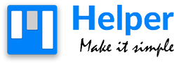

# Introduction

This documentation will allow you to install and configure the Helper platform on a **production** environment but also on a **development** environment if you want to evolve it according to your needs.

## Prerequisites

- PHP 8+
- MySQL 8+
- [Pusher](https://pusher.com/) account
