# Install Helper on development

> If you want to configure the **Helper** platform on the development environment, please follow the steps below:

## Prerequisites

In addition of the main [prerequisites](/?id=prerequisites), you must have this tools installed on your development environment:

- Composer
- NPM

## Screenshots

<div>
    </img> 
    </img> 
    </img> 
    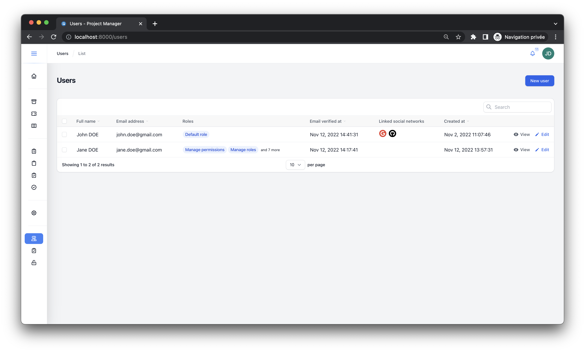</img> 
    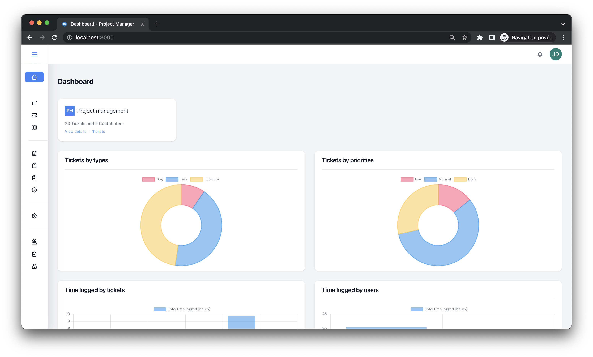</img> 
    </img> 
    </img> 
    </img> 
    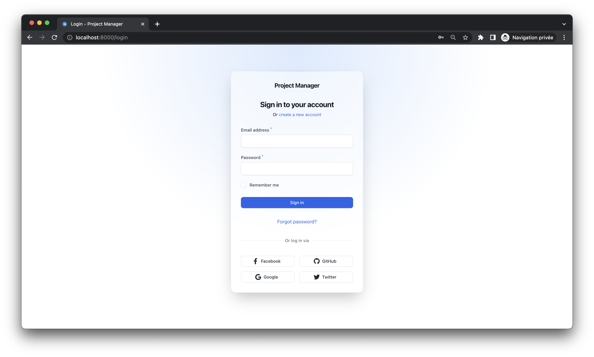</img> 
    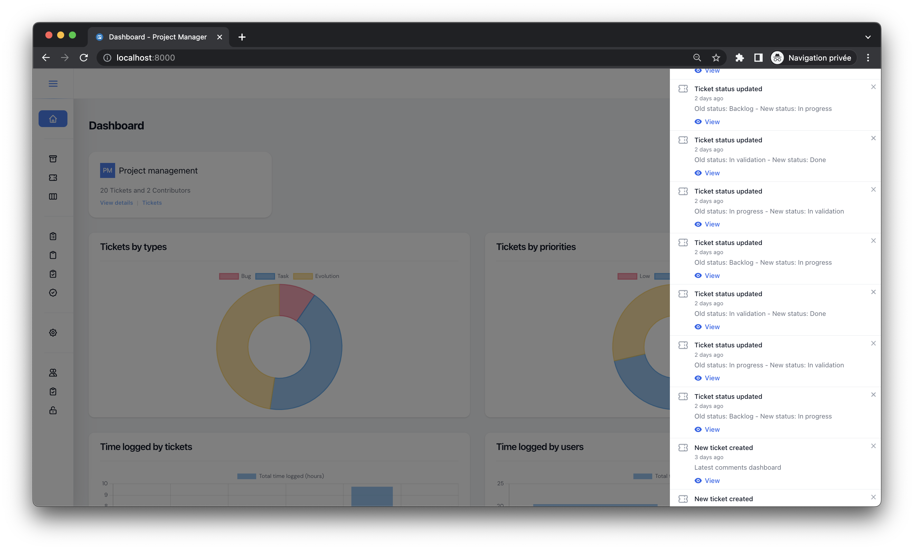</img> 
    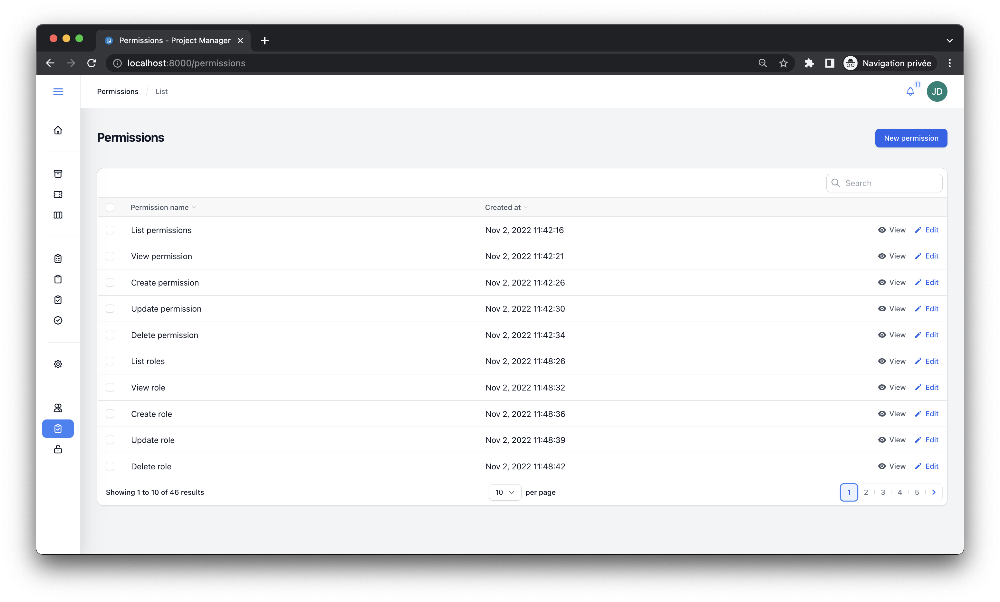</img> 
    </img> 
    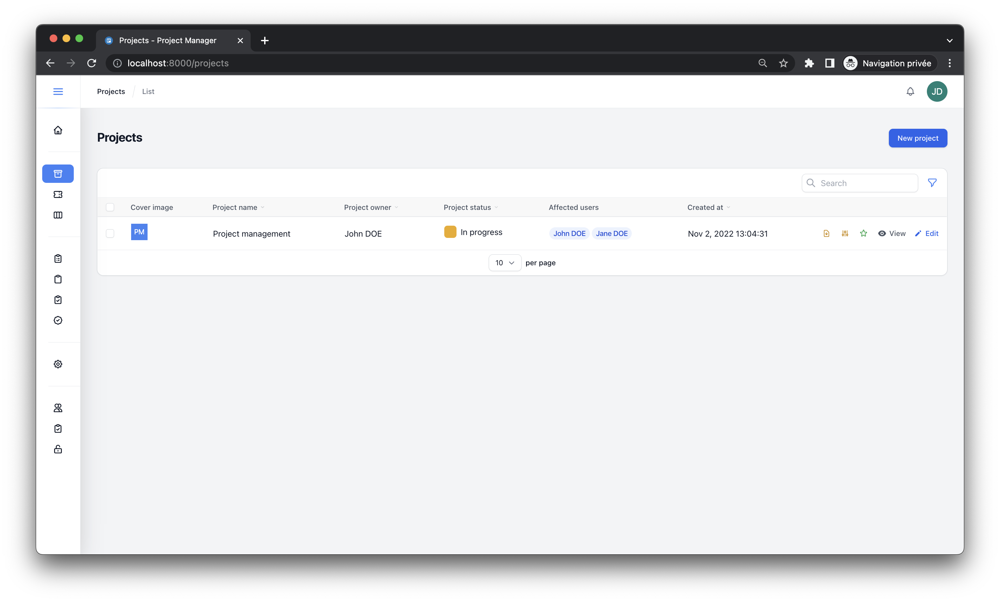</img> 
    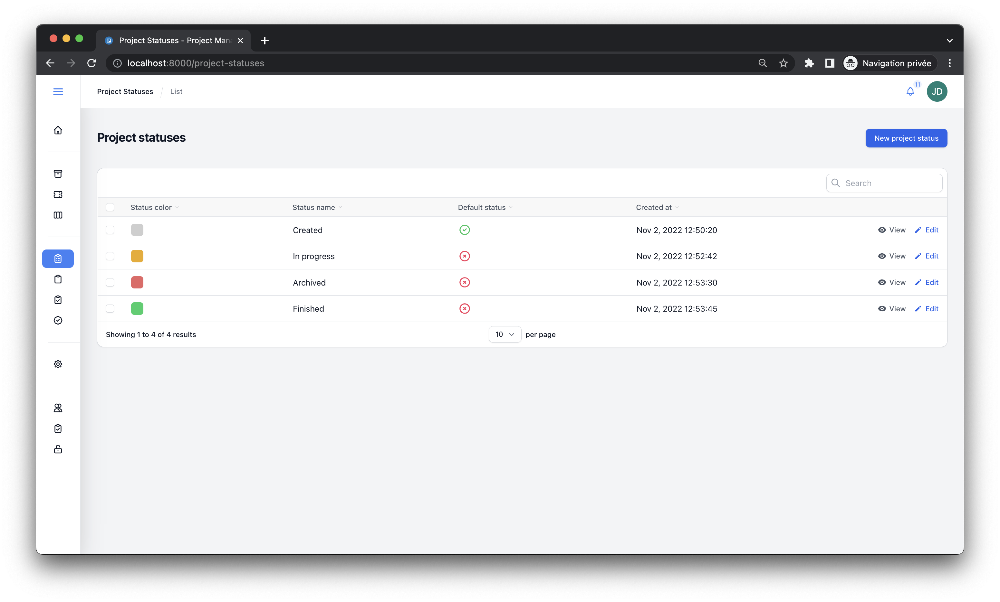</img> 
    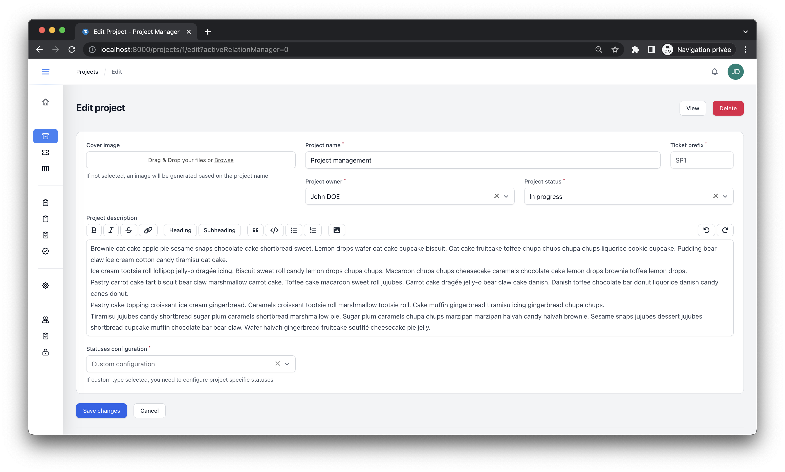</img> 
    </img> 
    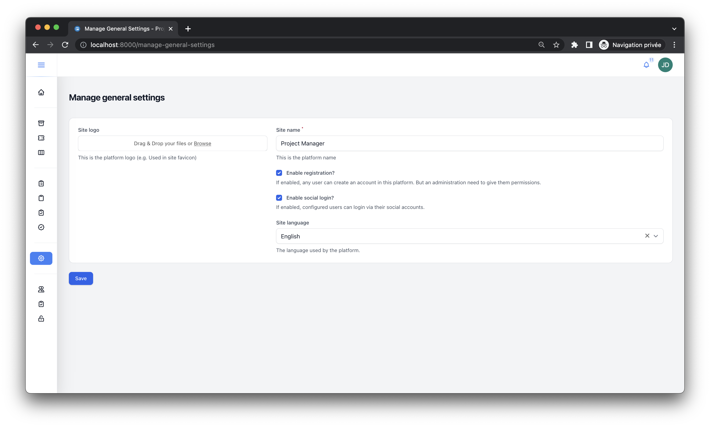</img> 
    </img> 
    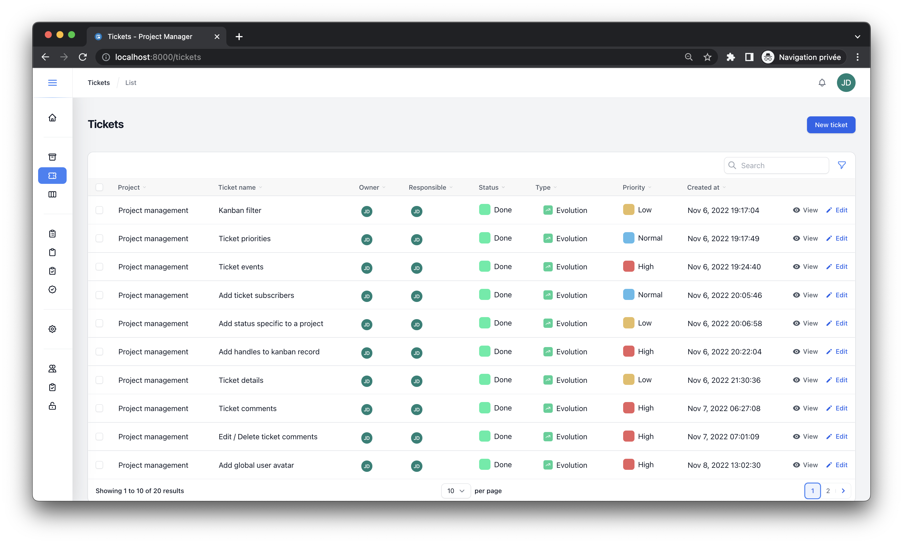</img> 
    </img> 
    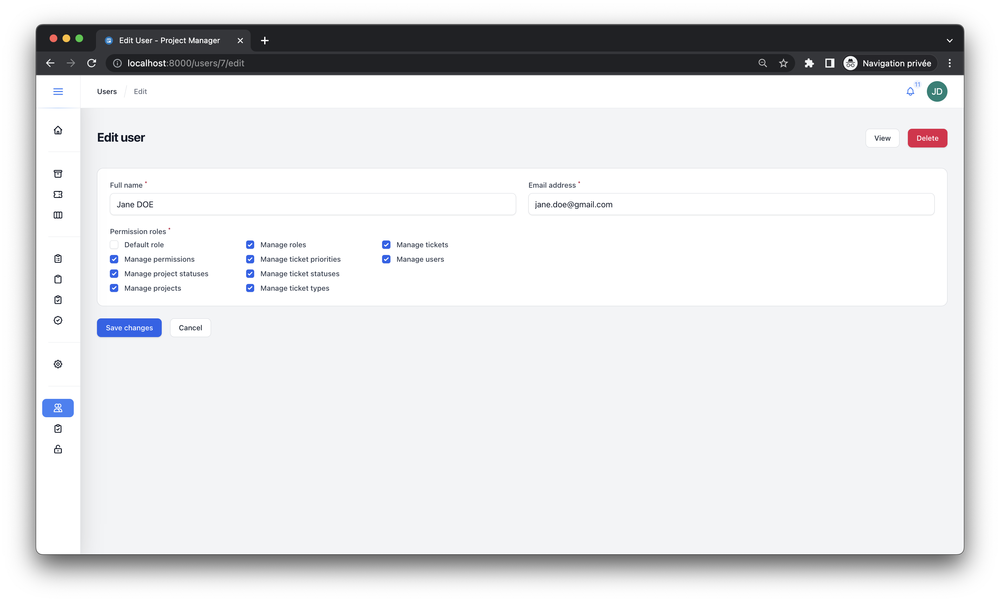</img> 
    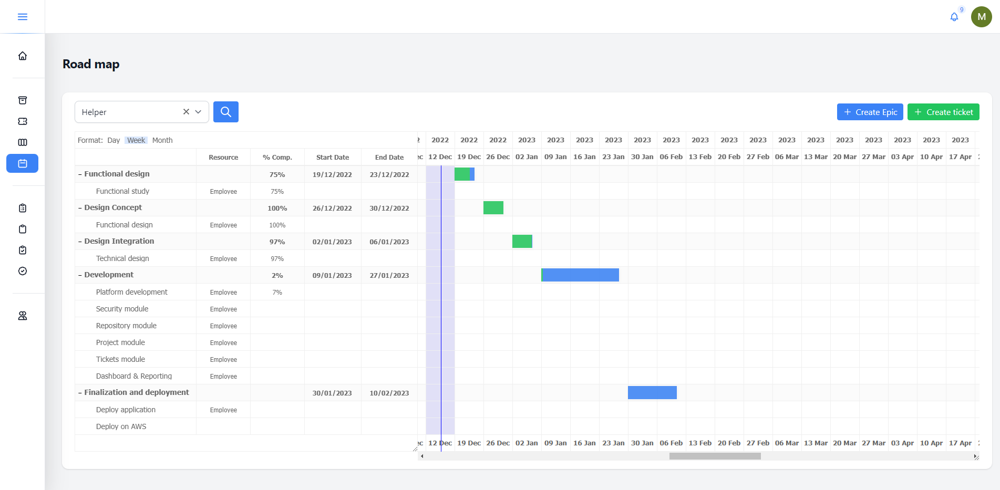</img> 
    </img> 
    </img> 
    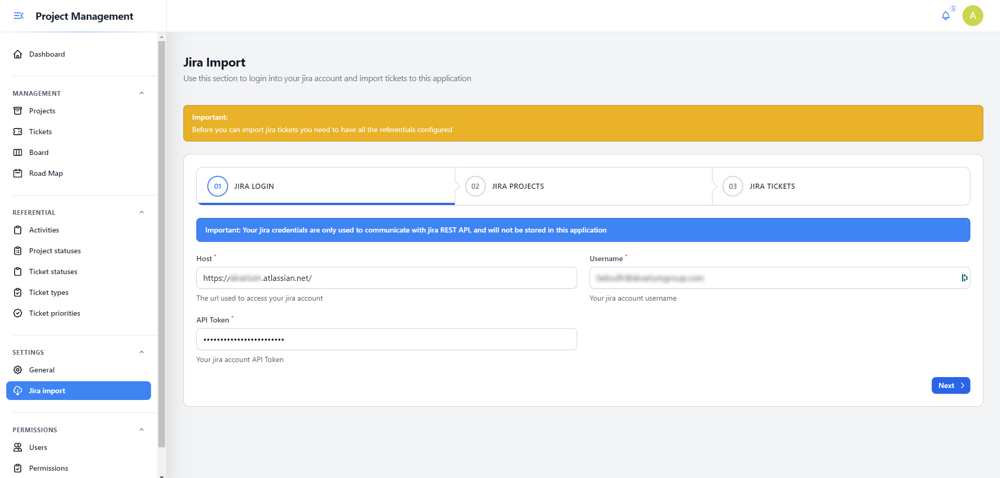</img> 
    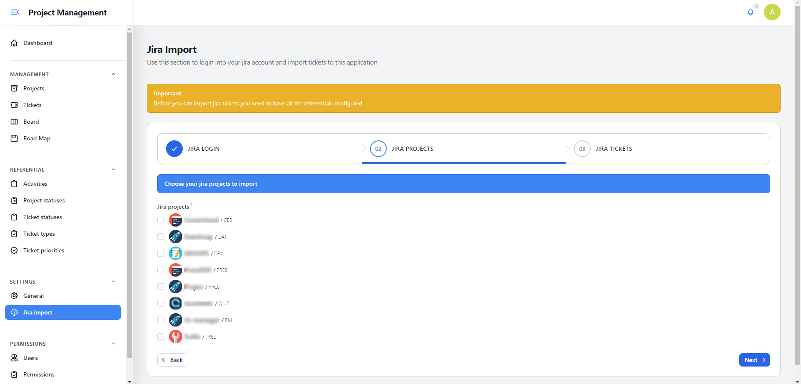</img> 
</div>


## Installing the project

First thing to do is to clone the project by using the git command: 

```bash
git clone https://github.com/devaslanphp/project-management.git
```

## Dependencies

After you clone the project, you need to follow the below steps to install **back** and **front** dependencies:

1. Run the following command to install **back** dependencies:

```bash
composer install
```

2. Run the following command to install **front** dependencies:

```bash
npm install
```

## Configuration

The next step is to configure the platform **environment variables**.

Before you can do this, you need to copy `.env.example` file to `.env` file, then you must configure the following elements:

|Key|Description|
|---|---|
|**APP_URL**|This is the URL that will be used to access your platform|
|**DB_HOST**|The host ip address or hostname to access your MySQL database|
|**DB_PORT**|The port used to access your MySQL database|
|**DB_DATABASE**|The name of your MySQL database|
|**DB_USERNAME**|The username to authenticate to your MySQL database|
|**DB_PASSWORD**|The password to authenticate to your MySQL database|
|**MAIL_HOST**|The host ip address or hostname to access your SMTP server used for sending emails|
|**MAIL_PORT**|The port used by your SMTP server|
|**MAIL_USERNAME**|The username to authenticate to your SMTP server|
|**MAIL_PASSWORD**|The password to authenticate to your SMTP server|
|**MAIL_ENCRYPTION**|The encryption used by your SMTP server|
|**MAIL_FROM_ADDRESS**|The email address that will send the emails from the platform|
|**PUSHER_APP_ID**|The Pusher application ID|
|**PUSHER_APP_KEY**|The Pusher application KEY|
|**PUSHER_APP_SECRET**|The Pusher application Secret|
|**PUSHER_HOST**|The Pusher host used|
|**PUSHER_APP_CLUSTER**|The Pusher cluster used (by default `mt1`)|
|**GITHUB_ID**|Github application ID (needed for Github social login)|
|**GITHUB_SECRET**|Github application Secret (needed for Github social login)|
|**GOOGLE_CLIENT_ID**|Google client ID (needed for Google social login)|
|**GOOGLE_CLIENT_SECRET**|Google client Secret (needed for Google social login)|
|**FACEBOOK_CLIENT_ID**|Facebook client ID (needed for Facebook social login)|
|**FACEBOOK_CLIENT_SECRET**|Facebook client Secret (needed for Facebook social login)|
|**TWITTER_CLIENT_ID**|Twitter client ID (needed for Twitter social login)|
|**TWITTER_CLIENT_SECRET**|Twitter client Secret (needed for Twitter social login)|

The last step in the configuration of the platform, is the generation of the **application key**, to do this please execute the following command at the root level of the folder `helper/`:

```bash
php artisan key:generate
```

## Queue

The platform uses a Queue system for sending notifications and emails, so you need to run this command from the root of `helper/` folder:

```bash
php artisan queue:work
```

## Database

The last step before being able to serve the **Helper** platform is the installation and configuration of the database.

1. Create a database on the same server that you configured in environment variables.
2. Run database migrations by executing the command

```bash
php artisan migrate
```

3. Run database seeder, to insert default **user**, **referentials** and **permissions** used by the platfom:

```bash
php artisan db:seed
```

> The credentials of the default user created by importing the SQL script in the third step are:
> 
> - **Email address**: john.doe@helper.app
> - **Password** : Passw@rd
> 
> This user has **all permissions** link to it's account

> Last thing before you can server the project you need to use the following command to generate vite assets:
> 
> - Generate assets for production: `npm run build`
> - Generate assets for development: `npm run dev` or `vite`

And voilà! You can now serve the platform as a **Laravel** application by running this command `php artisan serve` or use your favorite **WEB** server to serve it.

Last thing to do, run the below command to clear all caches:

```bash
php artisan optimize:clear
```

Enjoy *coding* into the **Helper** platform :nerd_face:
