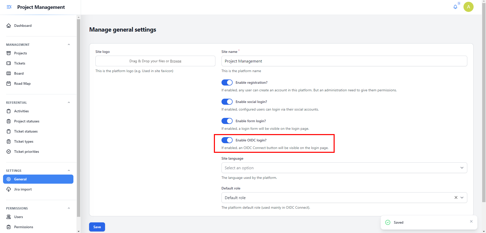
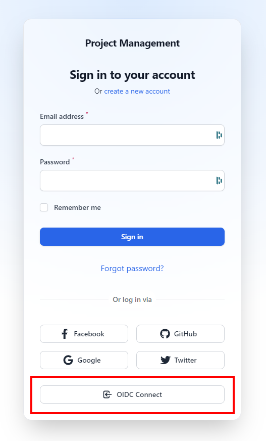

# OIDC Connect

The Helper has an authentication layer that let you configure your Open ID provider, so your users can use an SSO to authenticate to the Helper application.

## Configuration

All you need to do is to configure this environment variables:

```env
OIDC_CLIENT_ID=
OIDC_CLIENT_SECRET=
OIDC_DISCOVERY_ENDPOINT=
OIDC_REDIRECT_URI="${APP_URL}/oidc/callback"
OIDC_REALM="myrealm"
OIDC_URL_AUTHORIZE="${OIDC_DISCOVERY_ENDPOINT}/realms/${OIDC_REALM}/protocol/openid-connect/auth"
OIDC_URL_ACCESS_TOKEN="${OIDC_DISCOVERY_ENDPOINT}/realms/${OIDC_REALM}/protocol/openid-connect/token"
OIDC_URL_RESOURCE_OWNER_DETAILS="${OIDC_DISCOVERY_ENDPOINT}/realms/${OIDC_REALM}/protocol/openid-connect/userinfo"
OIDC_SCOPE="openid"
```

> Those variables can be found in the `.env.example` file

|Key|Description|
|--|---|
|OIDC_CLIENT_ID|The OIDC client id|
|OIDC_CLIENT_SECRET|The OIDC client secret|
|OIDC_DISCOVERY_ENDPOINT|The OIDC provider base url|
|OIDC_REDIRECT_URI|The url used by the helper as a callback for OIDC connect, **DON'T CHANGE**|
|OIDC_REALM|The OIDC provider REALM name|
|OIDC_URL_AUTHORIZE|The url used to authorize your users|
|OIDC_URL_ACCESS_TOKEN|The url used to get the access token|
|OIDC_URL_RESOURCE_OWNER_DETAILS|The ur used to get the authenticated user details|
|OIDC_SCOPE|The scopes that will be used to get information for your authenticated user. Separated by comma (,)|

## Example - Keycloak

In this example we will use the Keycloak Docker image, but feel free to use another OIDC provider.

1. Follow the steps in the Keycloak documentation, here: [https://www.keycloak.org/getting-started/getting-started-docker](https://www.keycloak.org/getting-started/getting-started-docker)
2. Configure the environment variables, in your `.env` file:

```env
OIDC_CLIENT_ID="YOUR_CLIENT_ID"
OIDC_CLIENT_SECRET="YOUR_CLIENT_SECRET"
OIDC_DISCOVERY_ENDPOINT="http://localhost:8080"
OIDC_REDIRECT_URI="${APP_URL}/oidc/callback"
OIDC_REALM="YOUR_OIDC_REALM"
OIDC_URL_AUTHORIZE="${OIDC_DISCOVERY_ENDPOINT}/realms/${OIDC_REALM}/protocol/openid-connect/auth"
OIDC_URL_ACCESS_TOKEN="${OIDC_DISCOVERY_ENDPOINT}/realms/${OIDC_REALM}/protocol/openid-connect/token"
OIDC_URL_RESOURCE_OWNER_DETAILS="${OIDC_DISCOVERY_ENDPOINT}/realms/${OIDC_REALM}/protocol/openid-connect/userinfo"
OIDC_SCOPE="openid"
```

3. Make sure in your administration **General settings** you have enabled `Enable OIDC login?` flag:



4. Your users can now click the button **OIDC Connect** in the login page:



> Feel free to customize your login page, by enabling / disabling login sections:
> - Form login
> - Social login
> - OIDC login

